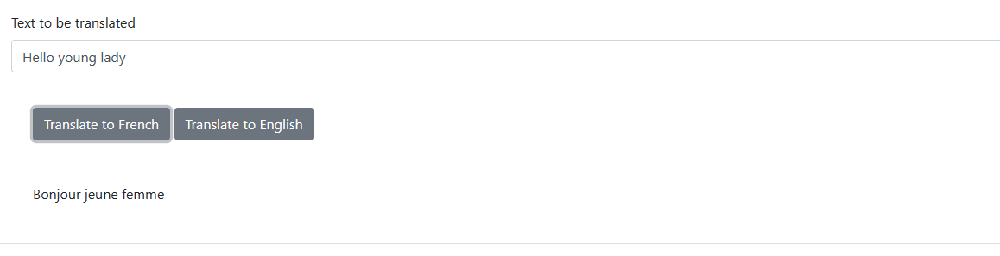

# **Flask Translation service**

This Flask microservice can translate text from English to French and vice versa. It's using 'deep_translator' package to achieve this.

Endpoints available:

- / - renders index.html
- /englishToFrench - translates text from English to French
- /frenchToEnglish - translates text from French to English
